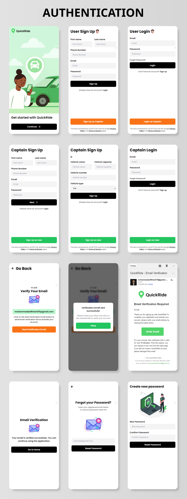
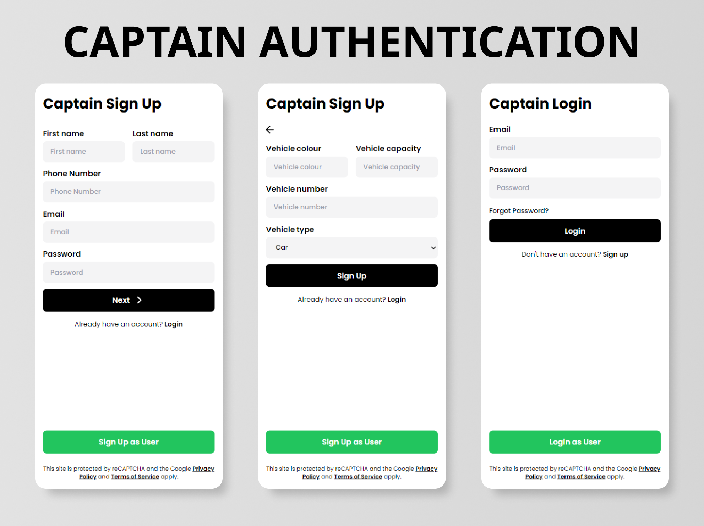
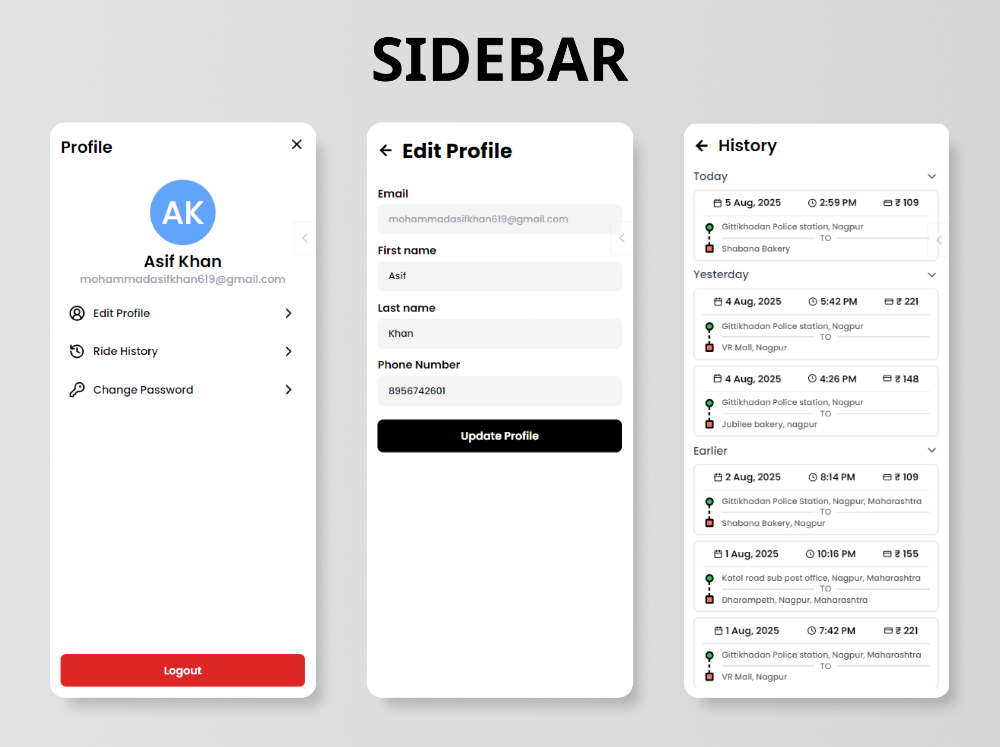
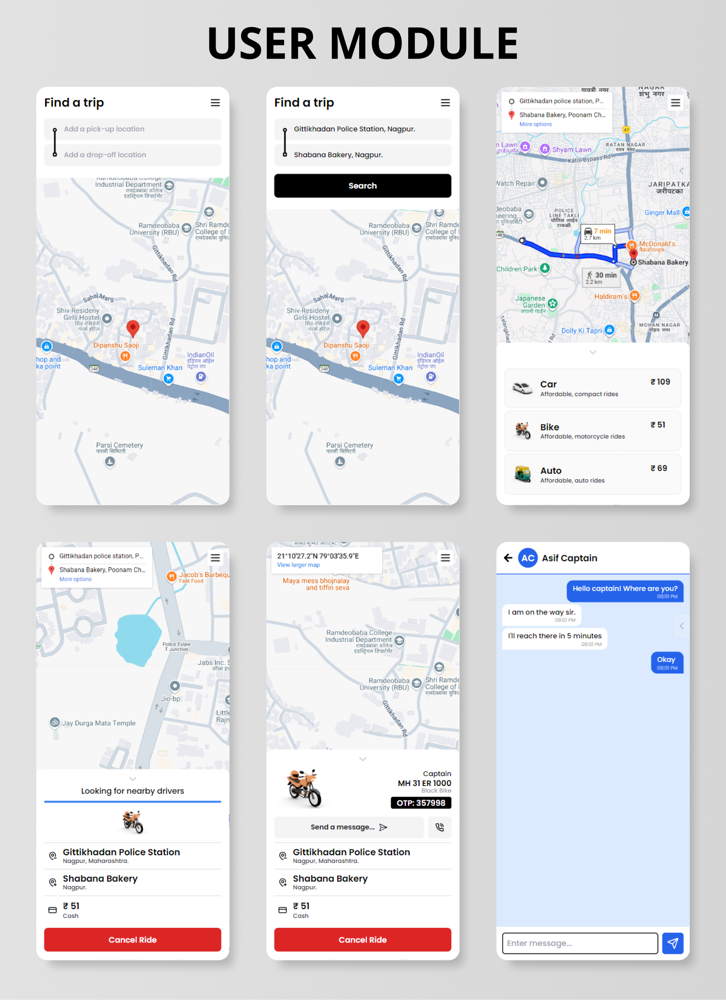

<div align="center">

  

  # 🚖 AmrutCAB

  ### _Your Ride, Your Way — Real-Time Cab Booking Redefined_

  <br/>

  [](LICENSE)
  [](https://react.dev)
  [](https://nodejs.org)
  [](https://www.mongodb.com)
  [](https://socket.io)
  [](https://vercel.com)

  <br/>

  <p align="center">
    <b>A production-grade, full-stack ride booking platform</b> built on the <b>MERN stack</b> — featuring real-time GPS tracking, in-app chat, smart fare estimation, OTP verification, and a beautiful mobile-first UI.
  </p>

  <br/>

  [🌐 Live Demo](https://quick-ride-asif.vercel.app) · [🐛 Report Bug](https://github.com/AyushNirmal13/AmrutCAB_Nasscom/issues) · [✨ Request Feature](https://github.com/AyushNirmal13/AmrutCAB_Nasscom/issues)

  ---

</div>

<br/>

## 📑 Table of Contents

<details open>
<summary>Click to expand</summary>

- [✨ Highlights](#-highlights)
- [⚙️ Tech Stack](#️-tech-stack)
- [🏗️ Architecture](#️-architecture)
- [🎯 Features](#-features)
- [🖼️ Screenshots](#️-screenshots)
- [⚡ Quick Start](#-quick-start)
- [🌐 Environment Variables](#-environment-variables)
- [📂 Project Structure](#-project-structure)
- [🚀 Deployment](#-deployment)
- [🤝 Contributing](#-contributing)
- [📄 License](#-license)
- [🙌 Acknowledgements](#-acknowledgements)

</details>

---

## ✨ Highlights

<table>
<tr>
<td width="50%">

🗺️ **Google Maps Integration**
<br/>Address autocomplete, geocoding, route visualization, and real-time driver location tracking — all powered by Google Maps APIs.

</td>
<td width="50%">

⚡ **Real-Time Everything**
<br/>Socket.IO-powered live ride status updates, GPS location streaming, and instant in-app chat between rider and captain.

</td>
</tr>
<tr>
<td width="50%">

🔐 **Enterprise-Grade Auth**
<br/>JWT-based authentication, bcrypt password hashing, email verification via NodeMailer, password reset flow, and role-based access control.

</td>
<td width="50%">

📱 **Mobile-First Design**
<br/>Pixel-perfect responsive UI built with Tailwind CSS — optimized for mobile with a beautiful desktop companion view.

</td>
</tr>
<tr>
<td width="50%">

🚗 **Multi-Vehicle Support**
<br/>Choose between Car, Bike, or Auto with dynamic fare calculation based on real-time distance and estimated travel time.

</td>
<td width="50%">

📊 **Production Logging**
<br/>Custom logging service that persists both frontend and backend logs to MongoDB with timestamps — perfect for debugging in production.

</td>
</tr>
</table>

---

## ⚙️ Tech Stack

<p align="center">
  
</p>

<br/>

| Layer | Technologies |
|:---|:---|
| **🎨 Frontend** | React 18 · Vite · Tailwind CSS · React Router v7 · React Hook Form · Lucide Icons · Axios |
| **🔧 Backend** | Node.js · Express.js · Mongoose (MongoDB) · Socket.IO · JWT · bcrypt · NodeMailer · Morgan |
| **🗺️ APIs** | Google Maps Geocoding · Distance Matrix · Places Autocomplete |
| **☁️ Deployment** | Vercel (Frontend) · Render (Backend) |
| **🛠️ Dev Tools** | ESLint · Nodemon · Postman · Custom DB Logger |

---

## 🏗️ Architecture

```
┌─────────────────────────────────────────────────────────────────────┐
│                         CLIENT (React + Vite)                       │
│                                                                     │
│  ┌──────────┐  ┌──────────┐  ┌────────────┐  ┌──────────────────┐  │
│  │ Screens  │  │Components│  │  Contexts   │  │  Hooks & Utils   │  │
│  │ (18 pgs) │  │ (12 UI)  │  │ User/Capt/ │  │ useAlert,        │  │
│  │          │  │          │  │ Socket      │  │ useCooldownTimer │  │
│  └────┬─────┘  └────┬─────┘  └─────┬──────┘  └────────┬─────────┘  │
│       └──────────────┴──────────────┴──────────────────┘            │
│                          │  Axios  │  Socket.IO Client              │
└──────────────────────────┼─────────┼────────────────────────────────┘
                           │  REST   │  WebSocket
┌──────────────────────────┼─────────┼────────────────────────────────┐
│                    SERVER (Node.js + Express)                        │
│                          │         │                                 │
│  ┌───────────┐  ┌────────┴─────────┴──┐  ┌─────────────────────┐   │
│  │  Routes   │  │    Controllers      │  │     Middleware       │   │
│  │ user      │  │ user.controller     │  │ auth.middleware      │   │
│  │ captain   │──│ captain.controller  │  │ (JWT verification)   │   │
│  │ ride      │  │ ride.controller     │  └─────────────────────┘   │
│  │ map       │  │ map.controller      │                             │
│  │ mail      │  │ mail.controller     │  ┌─────────────────────┐   │
│  └───────────┘  └─────────┬───────────┘  │     Services        │   │
│                           │              │ user / captain /     │   │
│                           │              │ ride / map / mail /  │   │
│                           │              │ logging / active     │   │
│                  ┌────────┴──────────┐   └──────────┬──────────┘   │
│                  │     Models        │              │               │
│                  │ User · Captain    │◄─────────────┘               │
│                  │ Ride · Logs       │                              │
│                  │ BlacklistToken    │                              │
│                  └────────┬──────────┘                              │
└───────────────────────────┼─────────────────────────────────────────┘
                            │
                   ┌────────┴──────────┐
                   │    MongoDB Atlas   │
                   │   (Cloud / Local)  │
                   └───────────────────┘
```

---

## 🎯 Features

### 🔐 Authentication & Security
| Feature | Description |
|:---|:---|
| 📧 Email/Password Login | Secure login with comprehensive form validation (React Hook Form) |
| ✉️ Email Verification | OTP-based email verification using NodeMailer with custom HTML templates |
| 🔑 Password Recovery | Forgot password + reset password flow with email-based tokens |
| 🛡️ JWT Auth | Token-based authentication with blacklisting for secure logout |
| 👥 Role-Based Access | Separate flows and protected routes for **Users** and **Captains** |

### 🚖 Ride Booking Engine
| Feature | Description |
|:---|:---|
| 🚗🏍️🛺 Multi-Vehicle | Choose between **Car**, **Bike**, or **Auto** ride types |
| 💰 Smart Fare Estimation | Dynamic pricing calculated from real distance & estimated travel time |
| 📍 Address Autocomplete | Google Places API-powered suggestions as you type |
| 🔄 Live Status Tracking | Ride states: `Pending → Accepted → Ongoing → Completed / Cancelled` |
| ⏱️ Auto-Cancellation | Rides automatically cancel if no captain accepts within the timeout |
| 🔒 Concurrency Control | A ride can only be accepted by one captain — preventing double booking |
| 🔢 OTP Verification | Captain must verify OTP from rider before starting the trip |

### 📡 Real-Time Features (Socket.IO)
| Feature | Description |
|:---|:---|
| 📍 Live GPS Tracking | Captain's location streams to rider in real-time on the map |
| 🔔 Instant Ride Updates | Status changes push immediately to both rider and captain |
| 💬 In-App Chat | Real-time messaging between rider and captain with DB persistence |
| 📅 Chat History | Messages stored with timestamps, scoped to ride — only visible to assigned parties |

### 👤 User & Captain Management
| Feature | Description |
|:---|:---|
| ✏️ Profile Editing | Update name, email, and phone from the in-app profile editor |
| 📜 Ride History | Browse all past rides with details (fare, route, status, date) |
| 📱 Sidebar Navigation | Elegant slide-out sidebar with quick links and logout |

### 🧰 Developer & System Utilities
| Feature | Description |
|:---|:---|
| 📊 Production Logger | Frontend + backend logs automatically persisted to MongoDB |
| 🔄 Force Reset | One-click button to clear local storage and recover from corrupted states |
| ⚠️ Alert System | Beautiful popup notifications for success, error, and warning alerts |
| 🏓 Keep-Alive Service | Auto-pings the server on Render to prevent cold-start spin-downs |

---

## 🖼️ Screenshots

<details>
<summary><b>🔐 Authentication Flow</b></summary>
<br/>

| User Authentication | Captain Authentication |
|:---:|:---:|
|  |  |

</details>

<details>
<summary><b>📱 Sidebar Navigation</b></summary>
<br/>

<div align="center">
  
</div>

</details>

<details>
<summary><b>🚖 User Module</b></summary>
<br/>



</details>

<details>
<summary><b>👨‍✈️ Captain Module</b></summary>
<br/>


</details>

---

## ⚡ Quick Start

### Prerequisites

Make sure you have the following installed:

- **Node.js** v18+ → [Download](https://nodejs.org)
- **MongoDB** (local) or a [MongoDB Atlas](https://www.mongodb.com/atlas) connection string
- **Google Maps API Key** with Geocoding, Distance Matrix, and Places APIs enabled
- **Gmail App Password** for email services (see [Google App Passwords](https://myaccount.google.com/apppasswords))

### 1️⃣ Clone the Repository

```bash
git clone https://github.com/AyushNirmal13/AmrutCAB_Nasscom.git
cd AmrutCAB_Nasscom
```

### 2️⃣ Install Dependencies

```bash
# Frontend
cd Frontend
npm install

# Backend
cd ../Backend
npm install
```

### 3️⃣ Configure Environment

Copy the example files and fill in your values:

```bash
# Frontend
cp Frontend/.env.example Frontend/.env

# Backend
cp Backend/.env.example Backend/.env
```

> 📌 See the [Environment Variables](#-environment-variables) section for details.

### 4️⃣ Start Development Servers

Open **two terminals** and run:

```bash
# Terminal 1 — Backend
cd Backend
npm run dev
```

```bash
# Terminal 2 — Frontend
cd Frontend
npm run dev
```

### 5️⃣ Open the App

| Service | URL |
|:---|:---|
| 🌐 Frontend | [http://localhost:5173](http://localhost:5173) |
| 🔧 Backend API | [http://localhost:3000](http://localhost:3000) |

---

## 🌐 Environment Variables

### Frontend (`Frontend/.env`)

| Variable | Description | Default |
|:---|:---|:---|
| `VITE_SERVER_URL` | Backend API base URL | `http://localhost:3000` |
| `VITE_ENVIRONMENT` | `development` or `production` | `development` |
| `VITE_RIDE_TIMEOUT` | Auto-cancel timeout in ms (e.g., 90000 = 1.5 min) | `90000` |

### Backend (`Backend/.env`)

| Variable | Description | Default |
|:---|:---|:---|
| `PORT` | Server port | `3000` |
| `RELOAD_INTERVAL` | Keep-alive ping interval (minutes) | `10` |
| `SERVER_URL` | Backend URL (for self-ping in production) | `http://localhost:3000` |
| `CLIENT_URL` | Frontend URL (CORS origin) | `http://localhost:5173` |
| `ENVIRONMENT` | `development` or `production` | `development` |
| `MONGODB_PROD_URL` | MongoDB Atlas connection string | — |
| `MONGODB_DEV_URL` | Local MongoDB connection string | `mongodb://127.0.0.1:27017/quickRide` |
| `JWT_SECRET` | Secret key for JWT signing | — |
| `GOOGLE_MAPS_API` | Google Maps API key | — |
| `MAIL_USER` | Gmail address for sending emails | — |
| `MAIL_PASS` | Gmail App Password | — |

---

## 📂 Project Structure

```
AmrutCAB_Nasscom/
│
├── 📂 Frontend/                    # React + Vite Application
│   ├── public/                     # Static assets, logos, screenshots
│   ├── src/
│   │   ├── components/             # Reusable UI components
│   │   │   ├── Alert.jsx           #   → Popup notification system
│   │   │   ├── Button.jsx          #   → Styled button component
│   │   │   ├── Input.jsx           #   → Form input with validation
│   │   │   ├── LocationSuggestions.jsx  # → Autocomplete dropdown
│   │   │   ├── NewRide.jsx         #   → New ride request panel
│   │   │   ├── RideDetails.jsx     #   → Ride info display card
│   │   │   ├── SelectVehicle.jsx   #   → Vehicle type picker
│   │   │   ├── Sidebar.jsx         #   → Navigation drawer
│   │   │   ├── Spinner.jsx         #   → Loading indicator
│   │   │   └── VerifyEmail.jsx     #   → Email verification widget
│   │   ├── contexts/               # React Context providers
│   │   │   ├── UserContext.jsx     #   → User state management
│   │   │   ├── CaptainContext.jsx  #   → Captain state management
│   │   │   └── SocketContext.jsx   #   → Socket.IO connection
│   │   ├── hooks/                  # Custom React hooks
│   │   │   ├── useAlert.jsx        #   → Alert trigger hook
│   │   │   └── useCooldownTimer.jsx#   → OTP/action cooldown
│   │   ├── screens/                # Page-level components (18 screens)
│   │   │   ├── GetStarted.jsx      #   → Landing / onboarding
│   │   │   ├── UserLogin.jsx       #   → User login
│   │   │   ├── UserSignup.jsx      #   → User registration
│   │   │   ├── UserHomeScreen.jsx  #   → Main ride booking UI
│   │   │   ├── CaptainLogin.jsx    #   → Captain login
│   │   │   ├── CaptainSignup.jsx   #   → Captain registration
│   │   │   ├── CaptainHomeScreen.jsx#  → Captain dashboard
│   │   │   ├── ChatScreen.jsx      #   → In-ride messaging
│   │   │   ├── RideHistory.jsx     #   → Past rides list
│   │   │   ├── VerifyEmail.jsx     #   → Email verification page
│   │   │   ├── ForgotPassword.jsx  #   → Password recovery
│   │   │   ├── ResetPassword.jsx   #   → Password reset
│   │   │   └── ...                 #   → Edit profile, wrappers, etc.
│   │   ├── utils/                  # Utility functions
│   │   ├── App.jsx                 # Root component + routing
│   │   ├── main.jsx                # Vite entry point
│   │   └── index.css               # Global styles
│   ├── index.html                  # HTML template + SEO meta tags
│   ├── tailwind.config.js          # Tailwind CSS configuration
│   ├── vite.config.js              # Vite build configuration
│   └── vercel.json                 # Vercel deployment config
│
├── 📂 Backend/                     # Node.js + Express Server
│   ├── config/
│   │   └── db.js                   # MongoDB connection setup
│   ├── controllers/                # Route handlers
│   │   ├── user.controller.js      #   → User CRUD + auth logic
│   │   ├── captain.controller.js   #   → Captain CRUD + auth logic
│   │   ├── ride.controller.js      #   → Ride lifecycle management
│   │   ├── map.controller.js       #   → Maps API proxy
│   │   └── mail.controller.js      #   → Email sending logic
│   ├── models/                     # Mongoose schemas
│   │   ├── user.model.js           #   → User schema
│   │   ├── captain.model.js        #   → Captain schema (+ vehicle + location)
│   │   ├── ride.model.js           #   → Ride schema (+ messages + OTP)
│   │   ├── blacklistToken.model.js #   → Revoked JWT tokens
│   │   ├── frontend-log.model.js   #   → Frontend log entries
│   │   └── backend-log.model.js    #   → Backend log entries
│   ├── routes/                     # Express route definitions
│   ├── services/                   # Business logic layer
│   │   ├── map.service.js          #   → Google Maps API integration
│   │   ├── ride.service.js         #   → Fare calc, captain matching
│   │   ├── mail.service.js         #   → Email transport setup
│   │   ├── logging.service.js      #   → Morgan → MongoDB stream
│   │   └── active.service.js       #   → Keep-alive pinger
│   ├── middlewares/
│   │   └── auth.middleware.js      # JWT verification + role check
│   ├── templates/
│   │   └── mail.template.js        # HTML email templates
│   ├── socket.js                   # Socket.IO event handlers
│   └── server.js                   # Express app entry point
│
├── CODE_OF_CONDUCT.md
├── LICENSE                         # MIT License
└── README.md                       # ← You are here
```

---

## 🚀 Deployment

### Frontend → Vercel

1. Push your code to GitHub
2. Import the `Frontend` directory in [Vercel](https://vercel.com)
3. Set the **Root Directory** to `Frontend`
4. Add environment variables in Vercel dashboard
5. Deploy! 🎉

### Backend → Render

1. Create a new **Web Service** on [Render](https://render.com)
2. Set the **Root Directory** to `Backend`
3. **Build Command:** `npm install`
4. **Start Command:** `npm start`
5. Add environment variables (set `ENVIRONMENT=production`)
6. Deploy! 🎉

> 💡 **Tip:** The backend includes a keep-alive service that auto-pings the server every 10 minutes to prevent Render's free-tier spin-down.

---

## 🤝 Contributing

Contributions make the open-source community an amazing place to learn, inspire, and create. Any contributions you make are **greatly appreciated**!

1. ⭐ **Star** this repository
2. 🍴 **Fork** the project
3. 🌿 Create your feature branch
   ```bash
   git checkout -b feature/AmazingFeature
   ```
4. 💾 Commit your changes
   ```bash
   git commit -m "Add some AmazingFeature"
   ```
5. 📤 Push to the branch
   ```bash
   git push origin feature/AmazingFeature
   ```
6. 🔃 Open a **Pull Request**

> Please read the [Code of Conduct](CODE_OF_CONDUCT.md) before contributing.

---

## 📄 License

Distributed under the **MIT License**. See [`LICENSE`](LICENSE) for more information.

---

## 🙌 Acknowledgements

- **Original Project:** [QuickRide](https://github.com/asif-khan-2k19/QuickRide) by [Mohammad Asif Khan](https://github.com/asif-khan-2k19)
- **Maps:** [Google Maps Platform](https://developers.google.com/maps)
- **Icons:** [Lucide Icons](https://lucide.dev) · [Skill Icons](https://skillicons.dev)
- **Deployment:** [Vercel](https://vercel.com) · [Render](https://render.com)

---

<div align="center">

  <br/>

  **If this project helped you, consider giving it a ⭐!**

  <br/>

  Made with ❤️ by [AyushNirmal13](https://github.com/AyushNirmal13)

  <br/>

</div>
